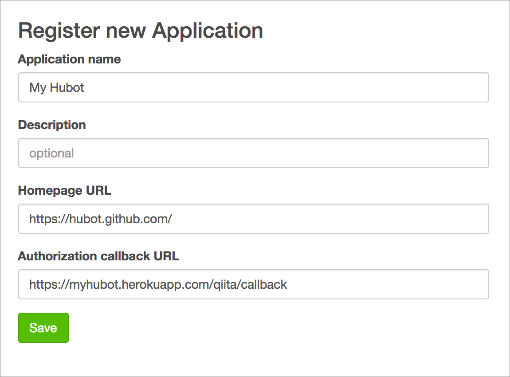
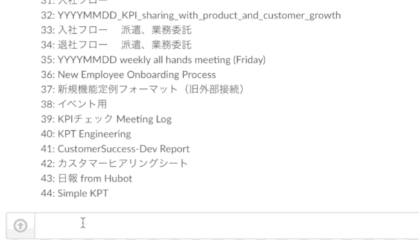

hubot-qiita
===========

[![Build Status][travis-badge]][travis]
[![npm-version][npm-badge]][npm]

A [Hubot] script to list and create [Qiita] items.

Currently supporting only [Qiita Team].

```
me > hubot qiita authenticate me
hubot > Visit this URL and authorize application: https://...
hubot > Authenticated to Qiita with id:ngs
me > hubot qiita list templates
hubot > Listing templates:
        1. 日報
        2. Daily standup minutes
        3. Sales meeting minutes
me > hubot qiita new item with template 1 "ngs 日報 2014/10/30"
hubot > Created new item *ngs 日報 2014/10/30* https://...

```

Commands
--------

```
hubot qiita authenticate me
hubot qiita list stocked items
hubot qiita list templates
hubot qiita new coediting item with template <template id> "<title>"
hubot qiita new item with template <template id> "<title>"
hubot qiita start recording "<title>" - Start recording chat room
hubot qiita stop recording
```

Configuration
-------------

Installation
------------

1. Add `hubot-qiita` to dependencies.

  ```bash
  npm install --save hubot-qiita
  ```

2. Update `external-scripts.json`

  ```json
  ["hubot-qiita"]
  ```

Configurations
--------------

### `HUBOT_QIITA_TEAM`

Team ID of your Qiita team.

### `HUBOT_QIITA_CLIENT_ID`, `HUBOT_QIITA_CLIENT_SECRET`

OAuth API keys. Grab yours from [User Settings].

Setup
-----

On [Register new Application] screen, fill the fields like this:



```
heroku config:set \
  HUBOT_QIITA_CLIENT_ID=<client id> \
  HUBOT_QIITA_CLIENT_SECRET=<client secret>
```

Create new item from template
-----------------------------



[hubot-qiita] extracts variables wrapped with `%{}` from templates.

If you have templates like this, Hubot asks contents to fill those variables and creates new item.

title:

```
%{title} KPT - %{Year}-%{month}-%{day}
```

tags:

```
KPT
```

body:

```
## Keep

%{Keep}

## Problem

%{Problem}

## Try

%{Try}

----

This entry was created by %{hubot:user} on %{hubot:room}
```

You can create templates from [Templates] page of your Qiita Team.

Run this command to start creating new item:

```
hubot qiita new item with template $TEMPLATE_ID
```

You can retrieve template ID with `hubot qiita list templates` command.

If you'd like to abort creation, just send `cancel!` in same room you started.

All Qiita Markdown formats are supported.

Recording chat
--------------

[hubot-qiita] supports recording messages in the room.

Mardown is supported as well.

To start recording session:

```
hubot qiita start recording
```

Hubot will start recording from the next message in the room until the recording session is canceled or stopped.

To stop recording and save it to Qiita Team:

```
hubot qiita stop recording
```

If you'd like to cancel recording:

```
hubot qiita cancel recording
```

Author
------

[Atsushi Nagase]

License
-------

[MIT License]


[Hubot]: http://hubot.github.com/
[Qiita]: http://qiita.com/
[Hubot]: https://hubot.github.com/
[Atsushi Nagase]: http://ngs.io/
[MIT License]: LICENSE
[travis-badge]: https://travis-ci.org/ngs/hubot-qiita.svg?branch=master
[npm-badge]: http://img.shields.io/npm/v/hubot-qiita.svg
[travis]: https://travis-ci.org/ngs/hubot-qiita
[npm]: https://www.npmjs.org/package/hubot-qiita
[User Settings]: https://qiita.com/settings/applications
[Register new Application]: https://qiita.com/settings/applications/new
[Qiita Team]: https://teams.qiita.com/
[hubot-qiita]: https://github.com/ngs/hubot-qiita
[Templates]: https://yourteam.qiita.com/templates
